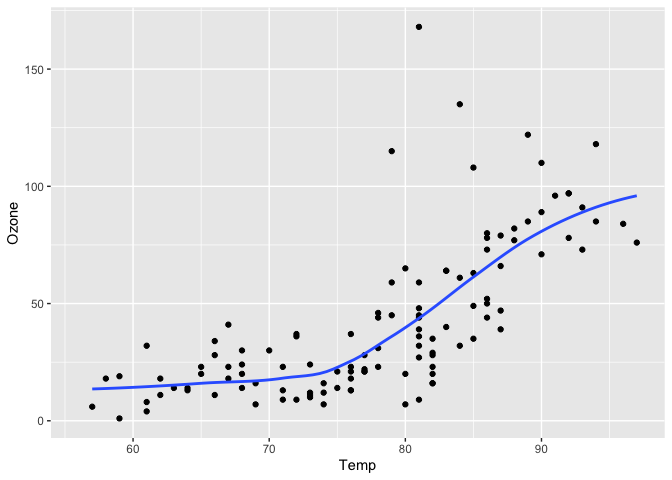
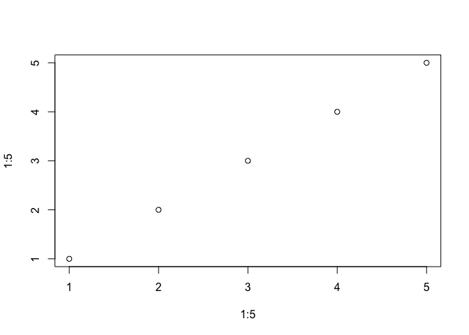
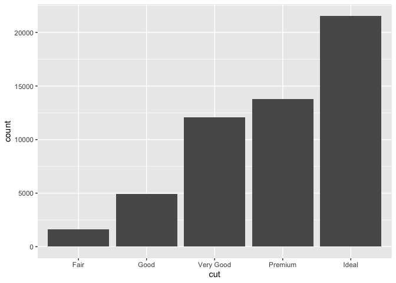
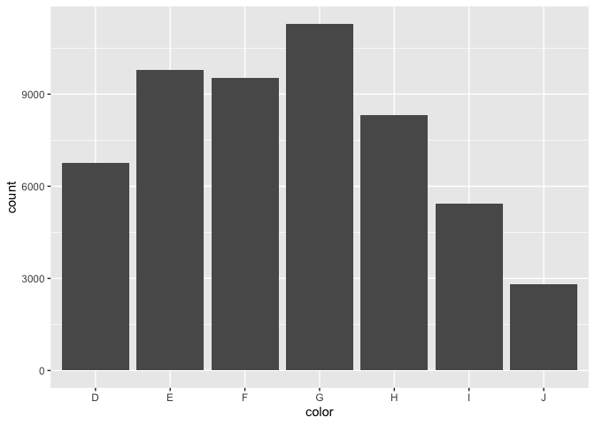
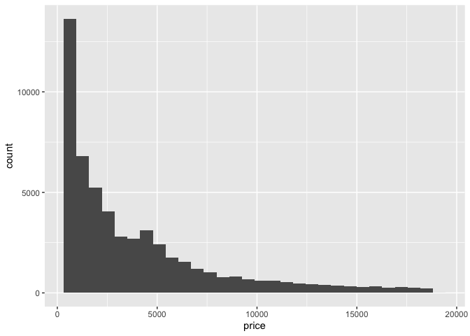
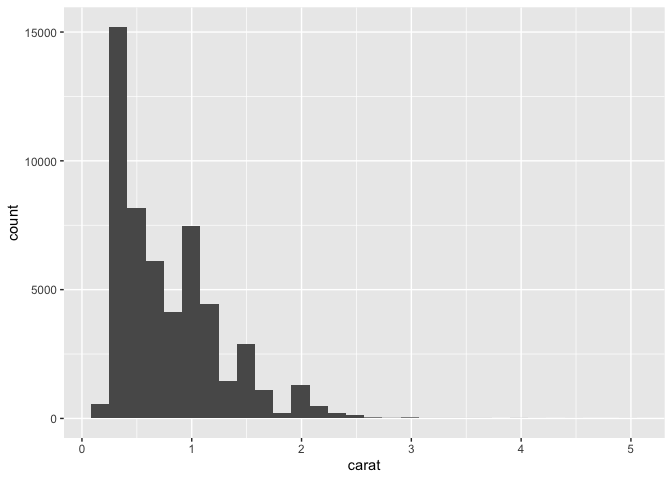

# My Project

- [<span class="toc-section-number">1</span>
  Quarto基本介绍](#sec-introduction)
- [<span class="toc-section-number">2</span> 输出图片](#输出图片)
- [<span class="toc-section-number">3</span> 输出表格](#输出表格)
- [<span class="toc-section-number">4</span> 插入公式](#插入公式)
- [<span class="toc-section-number">5</span>
  Callout标注框](#callout标注框)
- [<span class="toc-section-number">6</span>
  插入在线视频](#插入在线视频)

# Quarto基本介绍

Quarto是POSIT(原RStudio)团队开发的一个开源软件，
可以将包含R、Python、Julia、Observable
JS源程序的markdown文件产生运行结果后转换为各种输出格式，
这些源文件可以是普通的包含程序代码的markdown文件(扩展名为.qmd)，
也可以是Jupyter笔记本文件(扩展名为.ipynb)。 支持**HTML、MS Word、LaTeX
PDF、ePub、网站、幻灯片**等多种输出格式。[Section 1](#sec-introduction)

Quarto 是一个建立在 Pandoc 上的开源科技出版系统。

可以基于 Python、R、Julia 和 Observable 创建动态内容。

以纯文本 markdown 或 Jupyter 笔记本的形式编写文档。

以 HTML、PDF、MS Word、ePub
等格式发布高质量的文章、报告、简报、网站、博客和书籍。

用科学的 markdown
进行创作，包括方程、引文、交叉引用、图板、呼号、高级布局等等。

[庄闪闪CSDN](https://blog.csdn.net/qq_37379316/article/details/133670879?spm=1001.2014.3001.5502)

## 学习资源

[quarto官方学习指南](https://quarto.org/docs/output-formats/html-basics.html)

[quarto格式文件-北京大学数学学院李东风](https://www.math.pku.edu.cn/teachers/lidf/docs/Rbook/html/_Rbook/quarto.html)

[模板](https://quarto.org/docs/gallery/#articles-reports)

[基于R语言的Quarto文档教程](https://quarto.org/docs/get-started/hello/rstudio.html)

Quarto这样的软件的一个重要目的， 是实现”文学化编程”（literate
programming）， 并支持可重复科研。 文学化编程的意思是，
将论文和论文用到的计算机程序写在同一个源代码中，
经过一个运行、编译过程， 将计算机程序运行产生结果，
将**论文内容、源程序、程序产生的文字、表格、图形结果**有机地结合成一个最终论文，
可以用多种形式保存，如HTML、Word、PDF等。
用这种办法可以将研究过程很好地记录下来并可以很容易地重现研究结果，
所以可以支持可重复科研。

## 自动生成日期

today,now,last-modified date-format: full,long,medium,short,iso

[djhcod-Github](https://github.com/djhcod/Quarto-foundation.github.io)

## 生成输出文件

``` r
library(quarto)
quarto_render('Quarto入门.qmd',output_format="pdf")
```

## YAML

### format

#### html

- toc:true 自动生成目录

- toc-depth:3 目录内容包含3级标题

- number-sections:true 自动生成章节的编号并显示编号

- toc-expand：在一开始目录显示到多少级，默认显示到一级标题。当向下浏览内容时目录会自动展开到toc-depth所设置的层级。设置为true时，则在一开始就展开所有目录；设置为false则在一开始折叠所有目录。

#### pdf

#### 演示文稿

Quarto格式可以转换为演示文稿， 支持如下形式的演示文稿：

- revealjs: 这是网页格式的演示文稿， 功能比较强；

- pptx: 这是MS Power Point格式的演示文稿；

- beamer: 这是LaTeX的Beamer演示文稿。

演示文稿分为多个帧(frame)， 每帧用二级标题作为标志并以其为标题。
用一级标题作为单独的分节帧， 将单独显示在一帧中。

帧也可以没有标题，比如仅有照片的帧， 这时，
用三个或三个以上的减号连在一起标识新帧的开始。

## 清除缓存

``` r
knitr::clean_cache()
```

## 代码段执行选项

可用选项：

- eval:
  true或false，表示是否执行;设置为`fenced`，会代码块的设置，即”#\|“符号后的内容，也展示出来。[Figure 1](#fig-test)

- **echo: true或false，表示是否显示程序代码;**

- output: true,
  false或asis，表示显示为经整理的格式、不显示、不进行整理地显示;

- fig-show: 选false表示不显示生成的图形。

- message, warning: true或false，表示是否显示提示或警告信息;

- error: 选true表示在出错时仍继续运行，缺省是false。

- include: true或false, 表示代码与结果是否都包含，或都不包含，
  但不影响程序代码执行。

### 适用于html渲染

- freeze：在重新导出文档时是否冻结此前已经运行的结果。设置为true，则每次导出时不会再此运行此前已经得到运行结果的代码块。设置为auto，则仅在源文件发生更改时才重新计算以前生成的计算结果。默认为false。

- **code-fold: 是否折叠代码（适用于HTML渲染）。**

| Value | Behavior                     |
|-------|------------------------------|
| false | No folding (default)         |
| true  | Fold code (initially hidden) |
| show  | Fold code (initially shown)  |

- code-tools: 是否在网页右上角显示代码工具（适用于HTML渲染）。

- code-link:
  是否自动为函数加上超链接（适用于HTML渲染）。该功能基于downlit包，可以自动为识别到的函数加上一个链接到官方文档的超链接。

### echo=FALSE 代码不显示

    `geom_smooth()` using formula = 'y ~ x'

    Warning: Removed 37 rows containing non-finite values (`stat_smooth()`).

    Warning: Removed 37 rows containing missing values (`geom_point()`).



### eval=FALSE 代码仅显示不运行

``` r
print("Hello World!")
```

### include=FALSE 代码仅运行不显示

### echo=TRUE 显示代码

``` r
print(a)
```

    [1] 6

### collapse=TRUE 将代码块和输出结果一起显示

``` r
print(a)
## [1] 6
print("Hello World!")
## [1] "Hello World!"
```

### prompt=TRUE 输出结果显示”\>“符号

``` r
> print(a)
## [1] 6
> print("Hello World!")
## [1] "Hello World!"
```

### comment=“” 去除输出结果的”#”

``` r
> print(a)
[1] 6
> print("Hello World!")
[1] "Hello World!"
```

# 输出图片

## 图片选项

- label: 标签

- fig-cap: 图片说明

- fig-width, fig-height: 以英寸为单位的图形宽度、高度。
  这两个值越大，图形的尺寸越大， 分辨率越高；

- fig-asp：高宽比， 如fig-asp: 0.75。 这样可以仅规定fig-width，
  用fig-asp推算高度。

- out-width: 显示出的图片占页面行宽的比例， 如out-width: 80%。
  同时可以设置fig-align: center使得图片在行宽范围内居中放置。
  如果有并排放置的图片， 可以用out-width: 45%， 并设置fig-align:
  default。

- fig-format: 可设置为png。
  当输出为PDF格式时程序生成的图形文件默认使用pdf格式，
  可以用这个选项设置为PNG格式。

- fig-alt: 添加图片别名

## 图片示例

参见[Figure 1](#fig-test)

```` markdown
```{r 图片示例}
#| label: fig-test
#| fig-cap: "测试图片"
#| out-width: 80%
plot(1:5,1:5)
```
````



```` markdown
```{r}
#| label: fig-test2
#| output: false
library(ggplot2)
ggplot(diamonds,aes(x=price))+
  geom_histogram()
```
````

## 多图排版

见图[Figure 2](#fig-diamonds-1)，见图[Figure 3](#fig-diamonds-2)

``` r
library(ggplot2)
ggplot(diamonds,aes(x=cut))+
  geom_bar(stat = "count")

ggplot(diamonds,aes(x=color))+
  geom_bar(stat = "count")
```





钻石基本情况

## 复杂排版

layout属性是一个二维数组，其中第一维定义行，第二维定义列。如layout:
“\[\[1，1\]，\[1\]\]表示：创建两行，第一行有两列大小相等的列，第二行只有一列。

layout后的”\[\]“中的数字大小表示各个图像的相对大小。所以可以用任何值来自定义：

``` r
library(ggplot2)
ggplot(diamonds,aes(x=cut))+
  geom_bar(stat = "count")

ggplot(diamonds,aes(x=color))+
  geom_bar(stat = "count")

ggplot(diamonds,aes(x=price))+
  geom_histogram(bins = 30)

ggplot(diamonds,aes(x=carat))+
  geom_histogram(bins = 30)
```






钻石基本情况

# 输出表格

## 表格选项

## 表格示例,[Table 1](#tbl-test)

``` r
knitr::kable(iris[1:6,])
```

<div id="tbl-test">

| Sepal.Length | Sepal.Width | Petal.Length | Petal.Width | Species |
|-------------:|------------:|-------------:|------------:|:--------|
|          5.1 |         3.5 |          1.4 |         0.2 | setosa  |
|          4.9 |         3.0 |          1.4 |         0.2 | setosa  |
|          4.7 |         3.2 |          1.3 |         0.2 | setosa  |
|          4.6 |         3.1 |          1.5 |         0.2 | setosa  |
|          5.0 |         3.6 |          1.4 |         0.2 | setosa  |
|          5.4 |         3.9 |          1.7 |         0.4 | setosa  |

Table 1: 鸢尾花数据

</div>

# 插入公式

## 行内公式

这是$\frac{1}{2}$

## 独立公式@eq-1

<span id="eq-1">$$\frac{1}{2} \qquad(1)$$</span>

    toc: true
    toc-depth: 3
    toc-location: left

# Callout标注框

<div>

> **Note**
>
> Note that there are five types of callouts, including: `note`,
> `warning`, `important`, `tip`, and `caution`.

</div>

<div>

> **Tip with Title**
>
> This is an example of a callout with a title.

</div>

<div>

> **Expand To Learn About Collapse**
>
> This is an example of a ‘folded’ caution callout that can be expanded
> by the user. You can use `collapse="true"` to collapse it by default
> or `collapse="false"` to make a collapsible callout that is expanded
> by default.

</div>

<div>

> **Tip with Title**
>
> This is a callout with a title.

</div>

<div class="border">

This content can be styled with a border

</div>

# 插入在线视频

<https://www.youtube.com/watch?v=_f3latmOhew>
